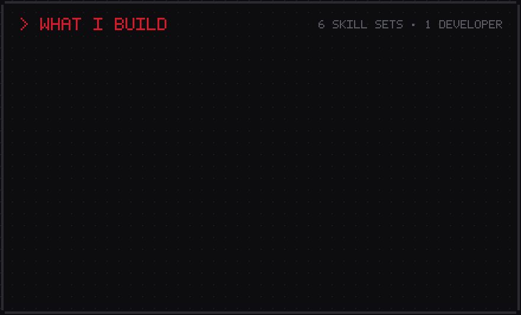

I'm Randel, a full-stack developer and startup founder studying Computer Science at the University of Saint Louis Tuguegarao. I build websites, web apps and mobile apps for Filipino users, starting from one question: who is this actually for?

**Open to work** in full-stack and mobile roles, and **open for freelance** websites for small businesses. [Email me](mailto:randelserafica1505@gmail.com).

## Selected work

| Project | What it is | Built with | Status |
| --- | --- | --- | --- |
| [**Karela**](https://karela-phi.vercel.app) | A running app with an AI coach and a ghost pacer that models how you tire instead of replaying your best run. While you run, you can report problems in your area, and reports are clustered on a map for the community and local government. Offline-first for low-end phones. | React Native, Expo, Supabase + PostGIS, Gemini | Thesis, in development · [Repo](https://github.com/Dell015/karela) |
| [**Tag.Ai**](https://tag-ai-omega.vercel.app) | A party card game for one phone or a whole table of them. Friends join a room, set a shared pot, and play themed decks while a heat meter decides how bold the next card gets. | Next.js, TypeScript, Supabase | Early beta |
| **Seated** | Find a table before you walk there. Shows live seat availability at partner restaurants and nearby food spots, with QR check-in and a mode that rewards keeping your phone down during the meal. | Expo, FastAPI, Supabase | In development |
| **Icarus** | A study tool that questions you the Socratic way and only lets your work through once you can defend every flaw it finds. | Web | MVP |
| **garahe** | Your whole vehicle history in one place: repairs, costs and decisions. A 3D viewer with clickable parts and an AI diagnostic assistant come next. | Web, Three.js | In development |
